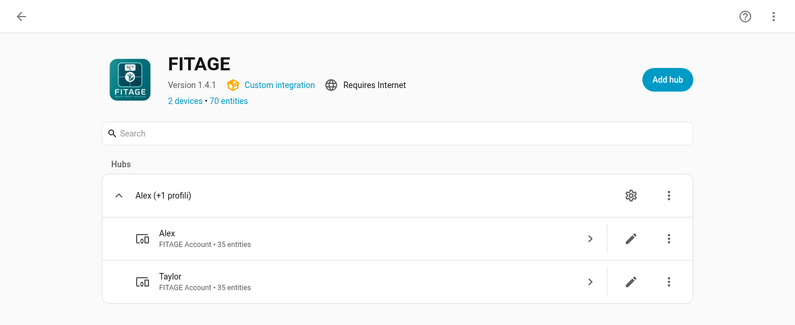
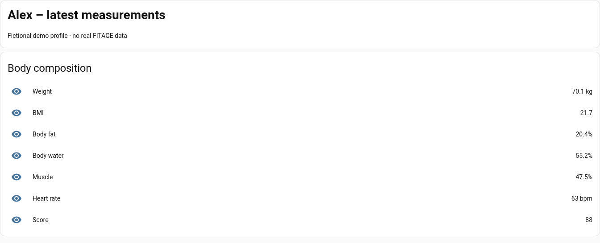
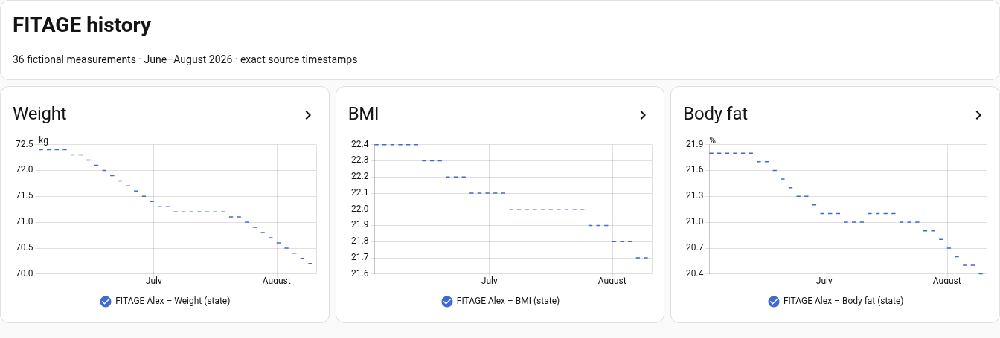
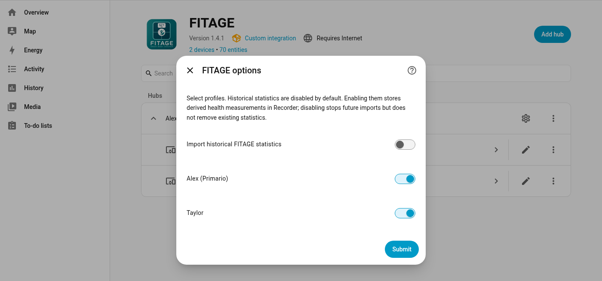

# Screenshot gallery

These screenshots were captured from a new, isolated Home Assistant Core demo using the unpacked FITAGE v1.4.1 integration. The FITAGE API was fully mocked. Alex and Taylor, all measurements, and all history shown here are fictional and were created specifically for this demo. No real FITAGE account, response, Store, Recorder database, or health measurement was used.

## Approved screenshots

### Integration overview

- File: `docs/images/fitage-integration-overview.png`
- Size: 1344 × 550 pixels
- Suggested use: README, Home Assistant Community Forum, repository or release updates.
- Suggested alt text: `FITAGE integration overview with two fictional profiles`

### Profile sensors

- File: `docs/images/fitage-profile-sensors.png`
- Size: 1344 × 545 pixels
- Suggested use: Community Forum feature explanation and support documentation.
- Suggested alt text: `Fictional FITAGE profile sensors for Alex`

### Historical dashboard

- File: `docs/images/fitage-history-dashboard.png`
- Size: 1344 × 455 pixels
- Suggested use: README, Reddit, Community Forum, and release updates.
- Suggested alt text: `Fictional FITAGE history dashboard for weight, BMI, and body fat`

### Statistics privacy option

- File: `docs/images/fitage-statistics-privacy-option.png`
- Size: 1400 × 655 pixels
- Suggested use: privacy documentation and the Community Forum explanation of explicit opt-in.
- Suggested alt text: `FITAGE statistics privacy option disabled by default`

## Privacy and reuse

The images contain no real names, email addresses, birth dates, FITAGE user IDs, measurement IDs, config-entry IDs, tokens, MAC addresses, browser profile data, local paths, or real health data. They may be reused in FITAGE project documentation and announcements as long as they are not presented as evidence of compatibility with an untested scale. FITAGE is an independent custom integration and is not affiliated with or supported by Home Assistant, FITAGE, QingNiu, or QNClouds.
